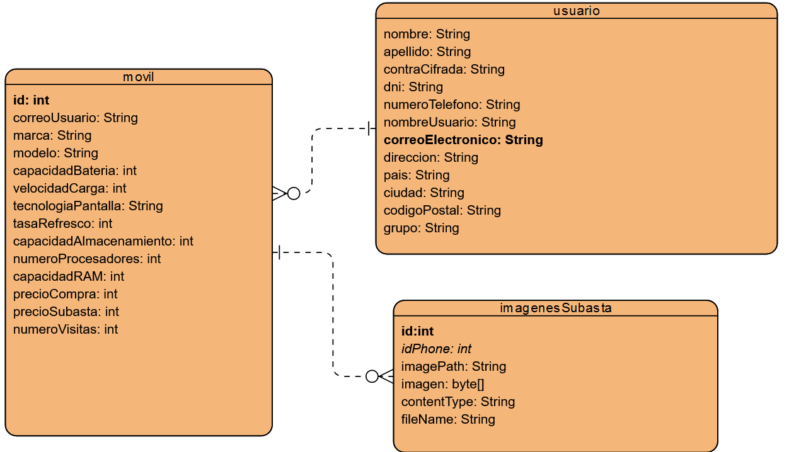
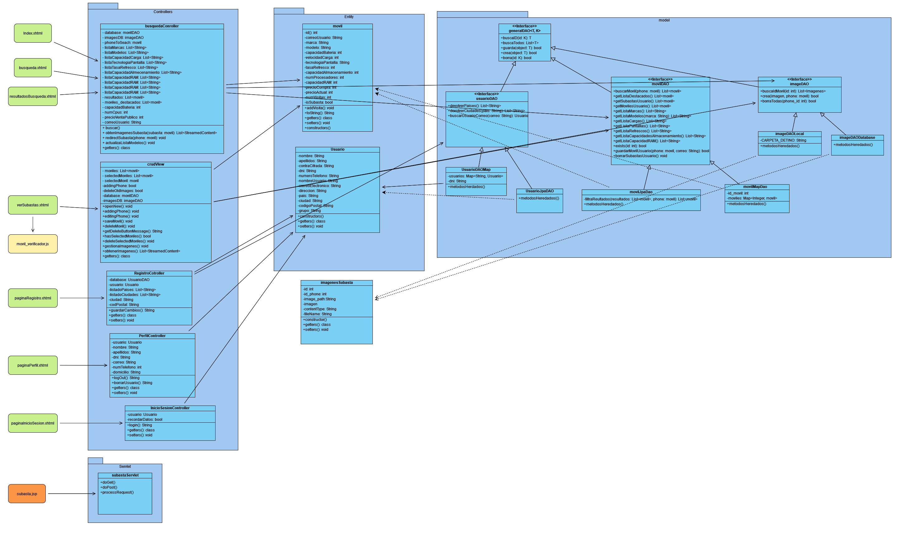
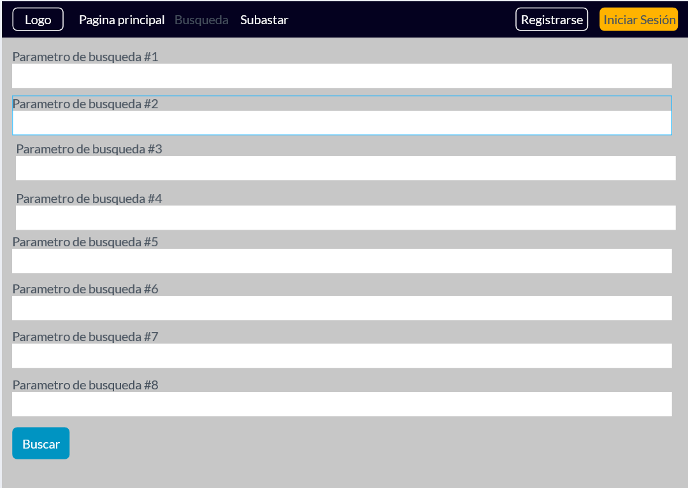
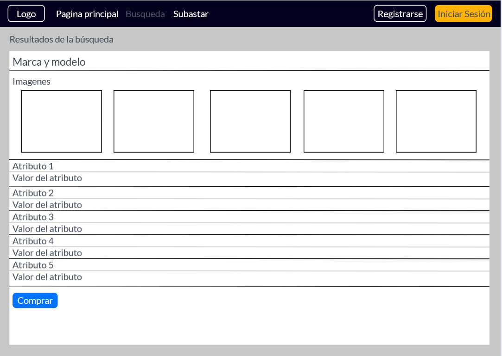
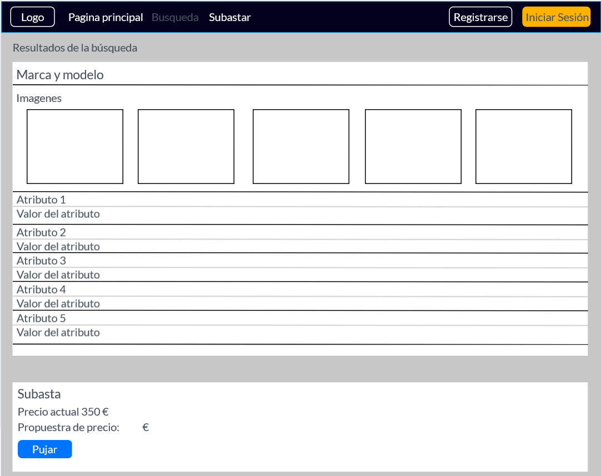
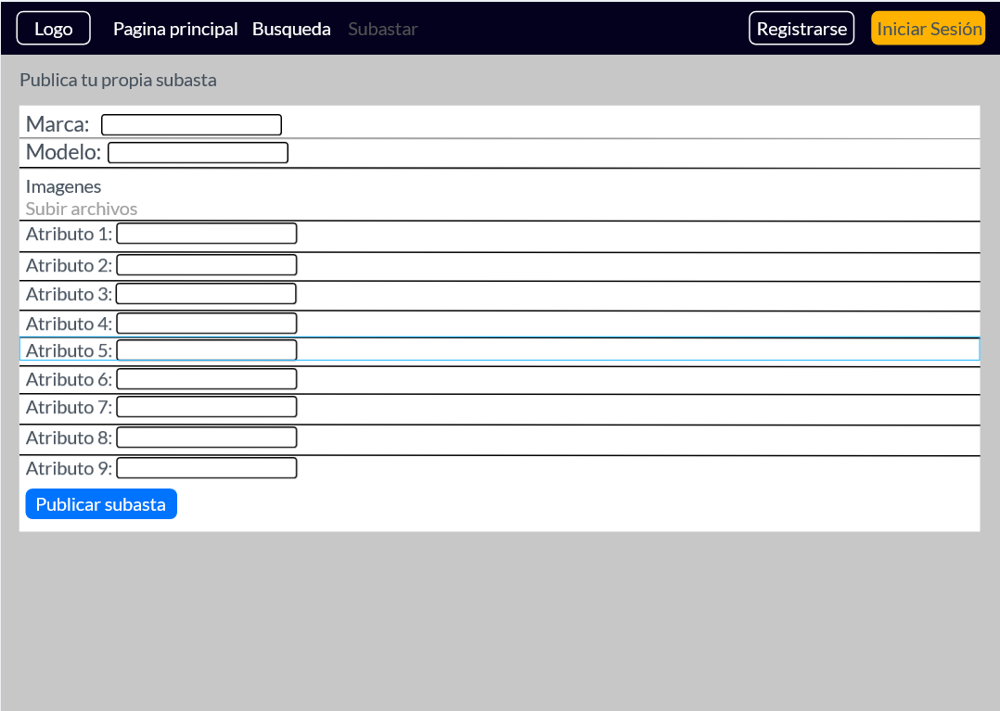
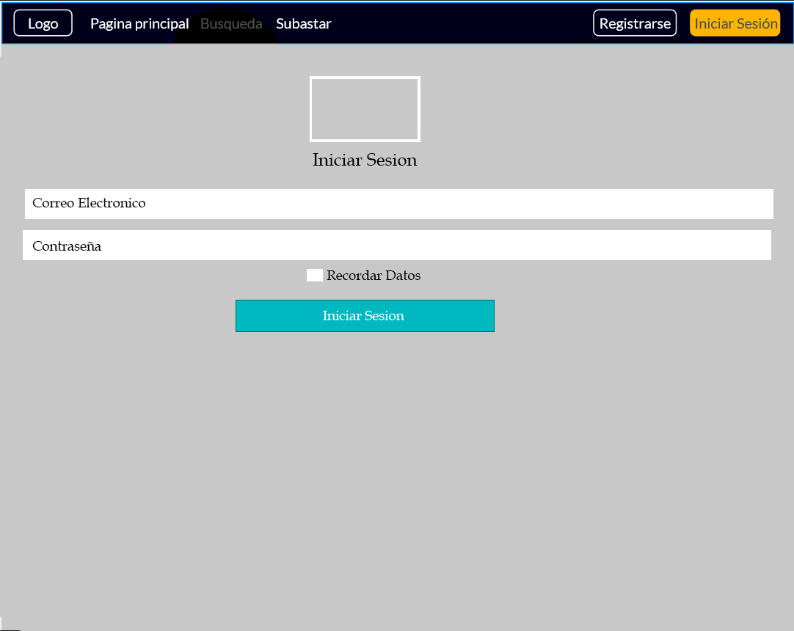
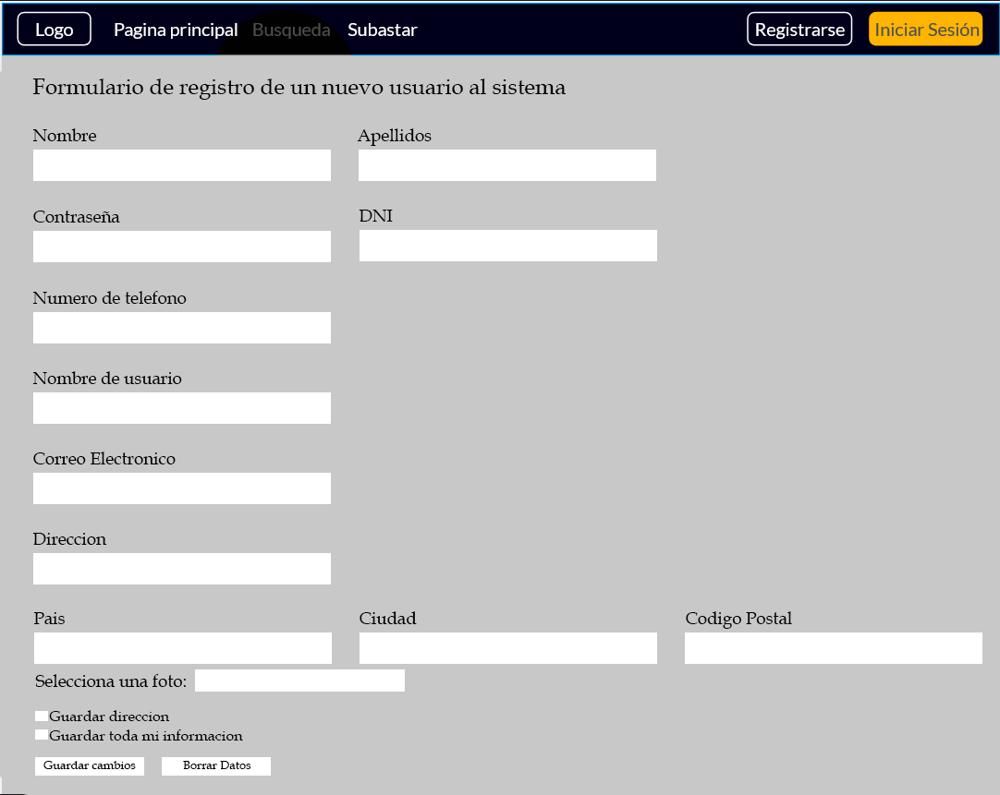
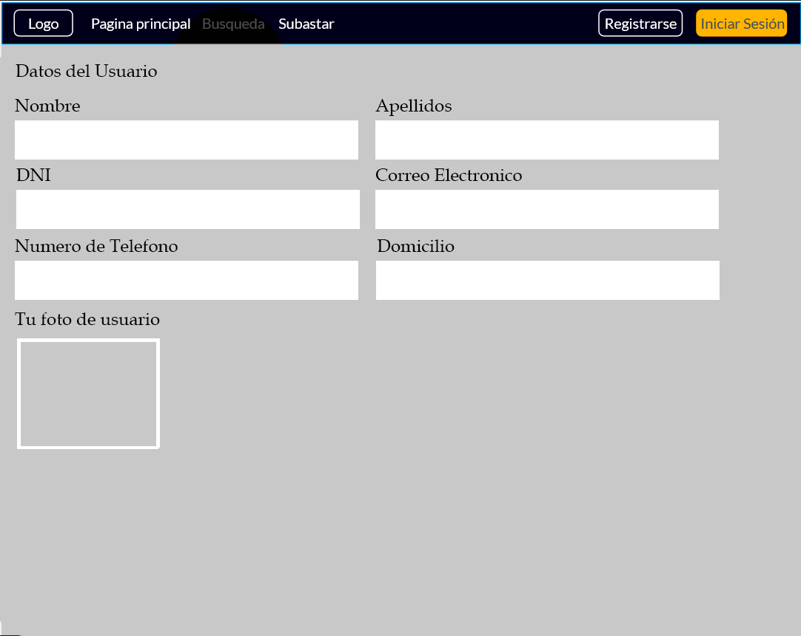

# MobileMarket

## Descripcion:
MobileMarket es un sitio web donde los usuarios pueden realizar tanto compras como ventas de sus diferentes dispositivos moviles.
Disponen ademas de la posibilidad de participar en subastas, teniendo acceso a adquirir aquellos moviles con alto precio.

### Miembros del equipo:
- Francisco Jose Cabrera Bermejo (fjcb0015) - Encargado de la entidad Usuario
- Alejandro Garrido Gómez (agg00227)  - Encargado de la entidad Movil

### Requisitos funcionales:
- Compra de dispositivos moviles: Accion que puede realizar un usuario registrado de comprar un movil cualquiera que desee
- Venta de dispositivos moviles: Accion tomada por un usuario registrado, de realizar la venta de un dispositivo movil en su propiedad
- Subasta de dispositivos moviles: Capacidad que tiene un usuario de la aplicacion para poder participar activamente en la compra de un movil, obteniendolo por un precio menor del que tiene
- Registro de un cliente: Accion que puede tomar cualquier usuario que nunca ha introducido sus credenciales en nuestra aplicacion, obteniendo ciertas acciones privilegiadas
- Modificacion de datos personales: Capacidad de un usuario ya registrado previamente de realizar cualquier modificacion necesaria sobre sus credenciales
- Historial de dispositivos moviles: Listado en el cual un usuario puede ver todos los dispositivos moviles los cuales ha adquirido hasta el dia de hoy

### Diagrama de entidad
El cual tiene la siguiente forma:

### Diagrama de clases con el MVC

### Storyboard
* Mockups de las vistas de la entidad de móvil
  * Página de búsqueda de subastas
    
  * Página de visualización de búsqueda
    
  * Página de subasta de un móvil
    
  * Página de creación de una nueva subasta
    
  * Pagina para Iniciar Sesion
    
  * Registro de un usuario a la aplicación web
    
  * Perfil del usuario con derecho a modificación de los datos personales
    